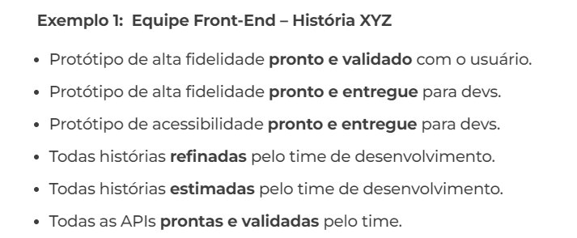
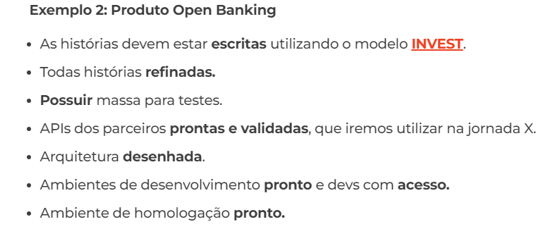

# DIA 01 (20/05/2024)

## Conceitos HTTP, API REST, JSON, User Stories & Issues

### Vou falar um pouco do conceito 

- HTTP : ` HTTPou HyperTextTransferProtocol,  é um protocolo usado para obter recursos,  como por exemplo documentos  HTML que vemos  e utilizamos diariamente  na WEB e além disso servem  também para intermediar  a comunicação com APIs. `

- API REST: `A sigla API ou'Interface de Programação de Aplicações'refere-se a serviços que são uma forma de integrar sistemas,possibilitando benefícios como a segurança dos dados,facilidade no intercâmbio entre informações com diferentes linguagens de programação e a monetização de acessos.Nos slides a seguir vamos nos aprofundar mais para entendermos melhor o que é API.`

### **DoR**

#### O que é Definition of Ready(DoR)

Traduzido como "Definição de preparado" , ela é uma técnica de qualidade e gestão de risco que ajuda a entrada de uma história para o delivery.
Então basicamente são pré-requisitos de um backlog, para que seja considerado apto para iniciar o desenvolvimento.

Com ela você garante a qualidade de uma história, épico, tarefa, sprint ou produto para que o trabalho possa ser iniciado

### **O que é importante estar no DoR?**

Para dar uma ajuda, pense nas seguintes perguntas:

- `O que o devTeam precisa ter para iniciar o desenvolvimento?`
- `O que precisa estar pronto para iniciar o desenvolvimento?`
- `Quais acessos, ferramentas, documentação e ambientes precisamos possuir para iniciar o desenvolvimento?`
- `Quais permissões e aprovações precisam ser realizadas para iniciar o desenvolvimento?`
- `Quais práticas e técnicas precisam ser feitas para iniciar o desenvolvimento?`

### **Exemplo 1**

### **Exemplo 2**

### ** Todos os critérios precisam estar cumpridos?**

É muito importante que todos os critérios que foram descritos , sejam cumpridos, pois se foram levantados, são importantes
Na falta de um, pode ocasionar uma dificuldade no futuro.

Usando o Exemplo 2 
 - O critério APIs dos parceiros prontas e validadas, não está pronto e muito menos validado, é o último critério que resta para iniciar a sprint, porém há uma pressão externa para que o desenvolvimento seja iniciado. 

 Ou seja , todo o desenvolvimento e testes será feito e baseado em mocks e não nas apis, pois a historia foi iniciada sem eles.
 Impactando possivelmente na entrega do produto

 ### **Conclusão**

 Você pode inicar o desenvolvimento caso um critério não seja cumprido, **MAASS** você irá correr um risco tão alto?