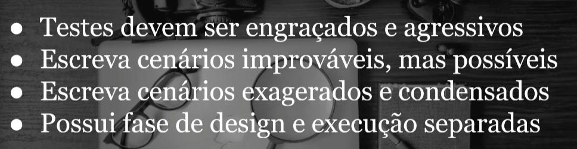

### DIA 01(19/06/24)

# Testes Exploratórios

## Seção 01

    Testes automatizados e manuais

Podemos criar um gráfico de esforço e tempo , entre testes manuais e automatizados.

Onde a curva de testes para cada um , vai ser diferente.
No começo a curva de esforço para testes manuais , de acordo com a demanda proposta,será mais fácil, e nao demandará tanto esforço.
Mas apartir que os testes vão aumentando e o tempo fica mais curto, exige mais e mais esforço.

Por isso que ao longo do tempo os testes automatizados, se "paga" com o tempo, seu início requer mais esforço, mas a médio e longo prazo, são de grande ajuda para os testes.

    Roteiros vs Exploratórios

Existem diferenças entre roteiros de testes e testes exploratórios.

E cada um tem seus benefícios, em exemplos desses testes , vamos supor que você está indo para uma loja que não conhece, nunca foi, só possui o endereço.

Você coloca o endereço no GPS e segue suas intruções. Podemos dizer de certa forma que é parecido com um roteiro de testes. Você testará, mas está seguindo um roteiro, intruções dadas a você.

Mas e se, você não possui um GPS? bem, as vezes temos alguma ideia da onde fica , usamos referências para chegar ao local desejado, em um caminho que não conhecemos.
Nessas situações, é normal prestar muito mais atenção ao seu redor.

No teste exploratórios, você navega pela aplicação , sem ter uma "rota" definida, sem ordens.

    Automação é sua amiga

Automação auxilia os testes de várias formas, os testes manuais e automatizados se complementam.
Então nao a necessidade de separar os testes, eles podem ser mesclados, facilitando a sua vida para várias atividades.

    Gerenciamento de Massa de dados.

> ENTRADA + AÇÃO = **RESULTADO**

Aqui onde geralmente colocamos resultado esperado e obtido, ainda faltando uma variável tipo "ambiente".

    Estratégias

Temos vários tipos de estratégias para definições mais claras para o planejamento, como por exemplo, a PERSONA.

Onde você irá criar um perfil de alguém se baseando em um perfil,ou pegar de alguém real, e com base nesse pefil , fazer oq seria necessário para atender esse tipo de pessoa, fazendo sua aplicação mais completa, para tipos diferentes de pessoas.

O Soap Opera, visa invés de um teste "comum" onde é planejado para testar um determinado objetivo, aqui ele tenta agrupar vários objetivos possiveis em um cenário, se tornando visivel o interrelacionamento

OBS: ainda irei fazer mais coisas, houve alguns contratempos, entao os videos so vi, e nao consegui passar resumo da udemy ou os projetinhos

