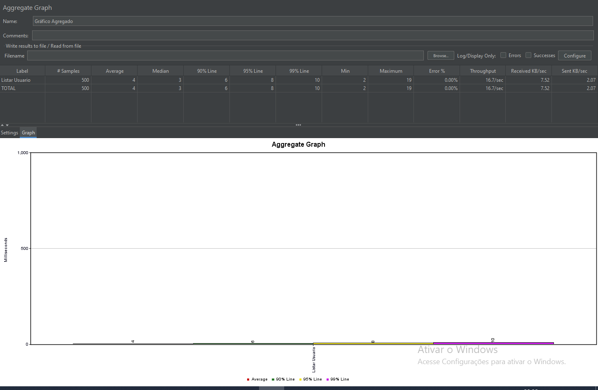
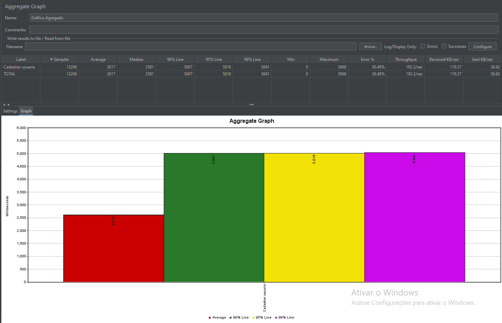
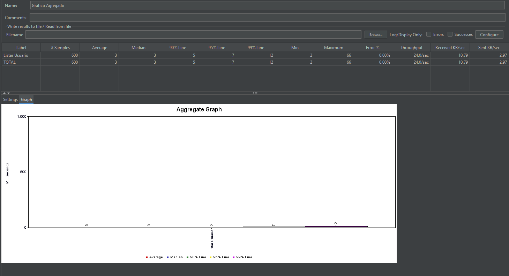
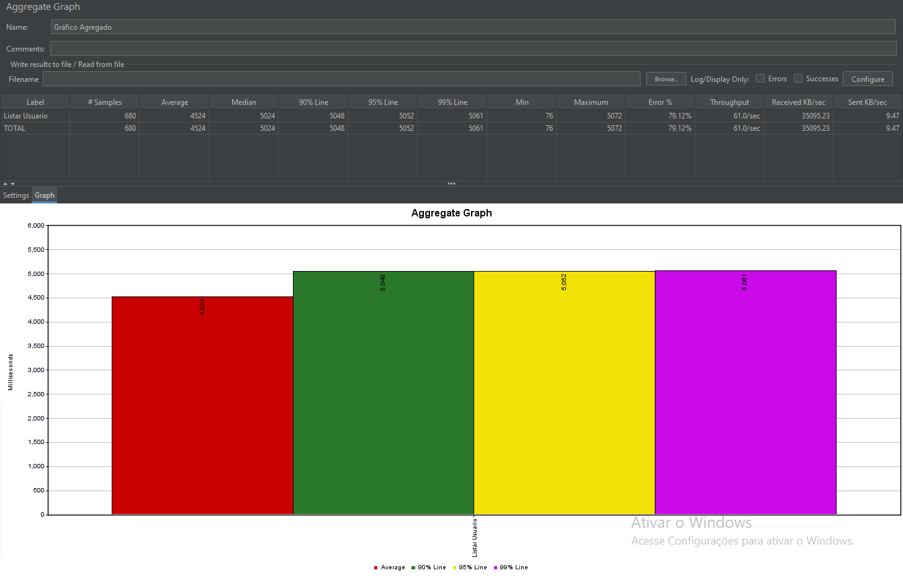
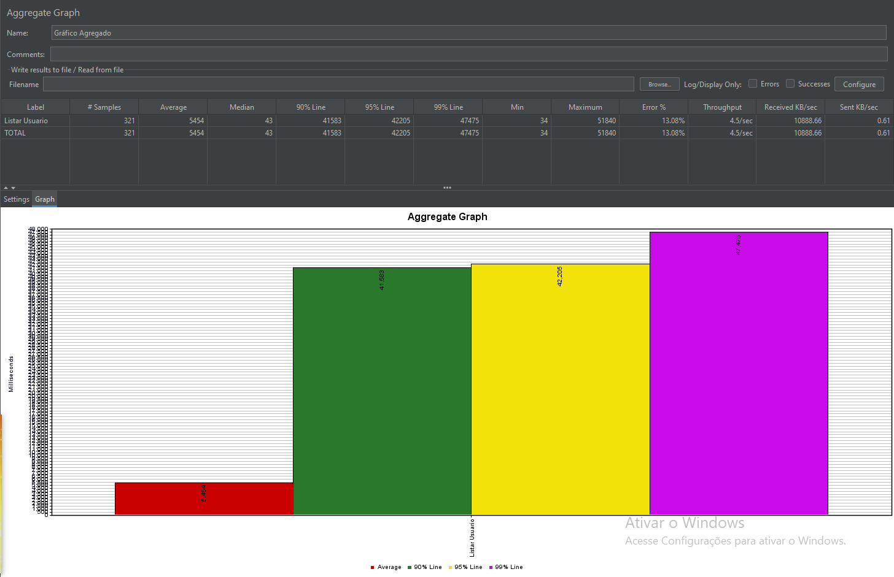
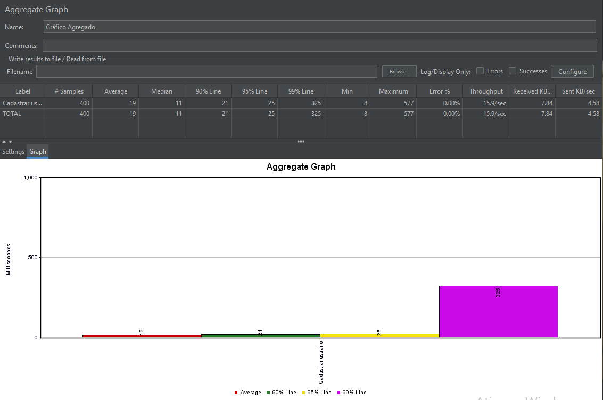
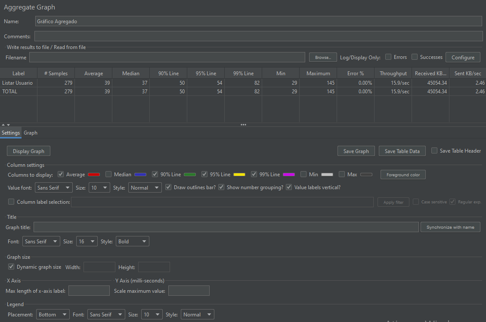

## Planejamento dos testes

### Links para cada teste de performance

- [Planejamento](https://github.com/KaueRuchinski/EstagioUOL/blob/3690a5e0c8c87169f87b57902b9bd93dc50250a0/Sprint5/planejamentoSP05.md)

    - [Login](https://github.com/KaueRuchinski/EstagioUOL/blob/pb_sprint5/Sprint5/planejamentoSP05.md#casos-de-testes-de-performance-para-rota-login)

    - [Usuarios](https://github.com/KaueRuchinski/EstagioUOL/blob/pb_sprint5/Sprint5/planejamentoSP05.md#teste-de-performance-usuarios)

    - [Produtos](https://github.com/KaueRuchinski/EstagioUOL/blob/pb_sprint5/Sprint5/planejamentoSP05.md#casos-de-testes-de-performance-para-rota-produtos)

    - [Carrinhos](https://github.com/KaueRuchinski/EstagioUOL/blob/pb_sprint5/Sprint5/planejamentoSP05.md#casos-de-testes-de-performance-para-rota-carrinhos)

    .

### - Funcionalidade do ServeRest Usuários, Produtos e Login


### 2.Resumo

Este teste está sendo feito para fins de conhecimento.

### 3.Pessoas a serem envolvidas
- Kauê Humenhuk Ruchinski

### 4.Funcionalidades ou Módulos a serem testados

> Usuários:

- 1º Teste criação de usuários(POST)

- 2º Teste busca/lista de usuários(GET)

- 3º Teste de edição de usuários(PUT)

- 4º Teste de Exclusão de usuários(DELETE)

> Produtos:

- 1º Teste para Cadastro de produtos(POST)

- 2º Teste para a busca/listagem de produtos cadastrados(GET)

- 3º Teste para buscar produto pelo ID(GET)

- 4º Teste de edição do produto(PUT)

- 5º Teste para exclusão de produtos(DELETE)

> Login:

- 1º Teste de Autenticação de Usuário (POST)

### 5.Local dos Testes

Serão na minha casa, em meu computador

### 6.Recursos necessários

- Necessita de um computador
- Necessita de periféricos
- Necessita de energia(luz, internet)
- Necessita de uma sala/quarto
- Apenas uma pessoa para realiza-lo
- Necessita de uma cadeira

### 7.Critérios Usados

Serão feitos um total de 14 testes e ? Casos.

Serão avaliados pelo status , se esta correto com o que se pede, e seu response

### 8.Riscos

- Cair energia
- Computador estragar
- Alguma intervenção na sala/quarto
- Alguma doença no tester
- Emergência familiar

### 9.Como os testes serão divulgados

Sera divulgado pelo github e pelo jira 

## US 004: [API] Carrinho

        DoR:

- **Banco de dados e infraestrutura para desenvolvimento disponibilizados.**
- **API de cadastro de usuários implementada.**
- **API de autenticação implementada.**
- **Ambiente de testes disponibilizado.**

        DoD:

- **CRUD da rota de Carrinhos implementado (CRIAR, LISTAR, ATUALIZAR E DELETAR).**
- **Análise de testes cobrindo a rota de carrinhos.**
- **Matriz de rastreabilidade atualizada.**
- **Automação de testes baseado na análise realizada.**

        Acceptance Criteria:

- **Usuários não autenticados não devem conseguir realizar ações na rota de Carrinhos.**
- **Não deve ser possível cadastrar apenas 1 carrinho por usuário.**
- **O carrinho deve ser vinculado ao usuário do token enviado no header Authorization.**
- **Ao cadastrar carrinho com sucesso é feita a redução da quantidade no cadastro de cada produto inserido no carrinho.**
- **Ao concluir uma compra o carrinho é excluído, sendo o carrinho excluído o vinculado ao usuário do token utilizado.**
- **Ao cancelar uma compra o carrinho é excluído e o estoque dos produtos desse carrinho é reabastecido.**
- **O carrinho excluído deverá ser o vinculado ao usuário do token utilizado.**

```
========================================================================================================================================
```
## Planejamento Testes de **Performance**

Alguns detalhes

### Local dos testes:

Na minha casa, em meu computador.

Configurações de Hardware:


### Ferramenta utilizada:

- JMeter

### Métricas:

- Tempo de resposta  
- Taxa de erro(5%)
- Throughput
- Latência
- Taxa de sucesso das requisições

Serão planejados os 7 tipos de testes para cada rota

# Teste de Performance `/usuarios`
O objetivo é que a API consiga lidar com ao menos 20 requisições simultâneas, considerando uma avaliação dentro de uma janela de 2-5 minutos para a avaliação. 

- Taxa Max de erros = 5% 

### Teste de Carga
```
- Especificações do teste: Avaliar como o sistema lida com níveis crescentes de carga.

- Usuários: Escalonar de 500 usuários simultâneos.

- Duração: 2 minutos

- Ramp-up: 25 segundos

- Resultado esperado: A API deve manter a estabilidade e um tempo de resposta aceitável.

- Resultado obtido: [Preencher após o teste]
```

<a href="teste_carga.png"> <></a>

### Teste de Estresse
```
Especificações do teste: Verificar como a API lida quando seus limites são ultrapassados.

- Usuários:  650 usuários 

- Duração: Até a falha

- Ramp-up: 25 segundos

- Resultado esperado: Identificar o ponto de falha e os principais gargalos.

- Resultado obtido: [Preencher após o teste]
```
<a href="teste_estresse.png"> <></a>

### Teste de Escalabilidade
```
- Especificações do teste: Incrementar em 20% o limite máximo de usuários tanto para uso contínuo quanto durante os picos.

- Usuários: 600 usuarios

- Duração: 15 minutos

- Ramp-up: 25 segundos

- Resultado esperado: A API deve suportar o aumento de carga sem degradação significativa.

- Resultado obtido: ↓
```

<a href="teste_escabilidade.png"> <></a>

Throughput : 24.0/sec
Error: 0.00%

### Teste de Pico
```
- Especificações do teste: Analisar a capacidade da API de lidar com súbitas cargas.

- Usuários: Picos de 680 usuários de repente.

- Duração: 5 minutos

- Ramp-up: 5 segundos

- Resultado esperado: A API deve lidar com os picos sem falhas críticas.

- Resultado obtido: [Preencher após o teste]
```

<a href="teste_pico.png"> <></a>

### Teste de Resistência
```
- Especificações do teste: Avaliar o desempenho com 500 usuários realizando requisições durante o período de 5 minutos.

- Usuários: 500

- Duração: 5 minutos

- Ramp-up: 30 segundos

- Resultado esperado: Manter estabilidade e um tempo de resposta aceitável.

- Resultado obtido: [Preencher após o teste]
```
<a href="teste-resistencia.png"> <></a>

### Teste de Concorrência
```
- Especificações do teste: Verificar o impacto de vários usuários fazendo login ao mesmo tempo.

- Usuários: 400 usuários tentando logar simultaneamente.

- Duração: 2 minutos

- Ramp-up: 25 segundos

- Resultado esperado: A API deve suportar os logins simultâneos sem falhas.

- Resultado obtido: [Preencher após o teste]
```
<a href="teste_concorrencia.png"> <></a>

### Teste de Capacidade
```
- Especificações do teste: Avaliar quantos usuários ou transações o sistema suporta mantendo uma performance estável.

- Usuários: 400 usuários.

- Duração: 4 minutos

- Ramp-up: 25 segundos

- Resultado esperado: Identificar o limite máximo de capacidade do sistema.

- Resultado obtido: [Preencher após o teste]
```
<a href="teste_capacidade.png"> <></a>

========================================================================================================================================

# Casos de Testes de Performance para Rota `/login`

## Teste de Carga

### Cenário 1: Login  Carga 
- **Especificações do teste:** Avaliar como o sistema lida com níveis crescentes de carga.
- **Usuários:**  500 usuários simultâneos.
- **Duração:**  2 minutos
- **Ramp-up:** 60 segundos
- **Passos:**

- **Resultado esperado:** A API deve manter a estabilidade e um tempo de resposta aceitável.
- **Resultado obtido:** [Preencher após o teste]

## Teste de Estresse

### Cenário 2: Login  Estresse
- **Especificações do teste:** Verificar como a API lida quando seus limites são ultrapassados.
- **Usuários:** 600 usuários
- **Duração:** Até a falha
- **Ramp-up:** 120 segundos
- **Passos:**

- **Resultado esperado:** Identificar o ponto de falha e os principais gargalos.
- **Resultado obtido:** [Preencher após o teste]

## Teste de Escalabilidade

### Cenário 3: Login com Escalabilidade
- **Especificações do teste:** Incrementar em 20% o limite máximo de usuários tanto para uso contínuo quanto durante os picos.
- **Usuários:** 400 usuários.
- **Duração:**  2 minutos
- **Ramp-up:** 90 segundos
- **Passos:**

- **Resultado esperado:** A API deve suportar o aumento de carga sem degradação significativa.
- **Resultado obtido:** [Preencher após o teste]

## Teste de Pico

### Cenário 4: Login com Carga de Pico
- **Especificações do teste:** Analisar a capacidade da API de lidar com súbitas cargas.
- **Usuários:** Picos de 150 usuários de repente.
- **Duração:** 5 minutos
- **Ramp-up:** 5 segundos
- **Passos:**

- **Resultado esperado:** A API deve lidar com os picos sem falhas críticas.
- **Resultado obtido:** [Preencher após o teste]

## Teste de Resistência

### Cenário 5: Login com Resistência
- **Especificações do teste:** Avaliar o desempenho com 500 usuários realizando requisições durante o período de 2 minutos.
- **Usuários:** 500
- **Duração:** 2 minutos
- **Ramp-up:** 60 segundos
- **Passos:**

- **Resultado esperado:** Manter estabilidade e um tempo de resposta aceitável.
- **Resultado obtido:** [Preencher após o teste]

## Teste de Concorrência

### Cenário 6: Login  Concorrência
- **Especificações do teste:** Verificar o impacto de vários usuários fazendo login ao mesmo tempo.
- **Usuários:** 400 usuários tentando logar simultaneamente.
- **Duração:** 4 minutos
- **Ramp-up:** 30 segundos
- **Passos:**

- **Resultado esperado:** A API deve suportar os logins simultâneos sem falhas.
- **Resultado obtido:** [Preencher após o teste]

## Teste de Capacidade

### Cenário 7: Login com Capacidade 
- **Especificações do teste:** Avaliar quantos usuários ou transações o sistema suporta mantendo uma performance estável.
- **Usuários:**  400 usuários.
- **Duração:** 4 minutos
- **Ramp-up:** 90 segundos
- **Passos:**

- **Resultado esperado:** Identificar o limite máximo de capacidade do sistema.
- **Resultado obtido:** [Preencher após o teste]

==================================================================================================================

# Casos de Testes de Performance para Rota `/produtos`

## Teste de Carga

### Cenário 1:Teste de Carga 
- Especificações do teste: Avaliar como o sistema lida com níveis crescentes de carga.
- Usuários: Escalonar 500 usuários simultâneos.
- Duração: 10 minutos
- Ramp-up: 60 segundos


- Resultado esperado: A API deve manter a estabilidade e um tempo de resposta aceitável.
- Resultado obtido: [Preencher após o teste]

## Teste de Estresse

### Cenário 2: Teste de  Estresse
- Especificações do teste: Verificar como a API lida quando seus limites são ultrapassados.
- Usuários: Começar com 650 usuários
- Duração: Até a falha
- Ramp-up: 45 segundos


- Resultado esperado: Identificar o ponto de falha e os principais gargalos.
- Resultado obtido: [Preencher após o teste]

## Teste de Escalabilidade

### Cenário 3: Teste de Escalabilidade
- Especificações do teste: Incrementar em 20% o limite máximo de usuários tanto para uso contínuo quanto durante os picos.
- Usuários: 600 usuários.
- Duração: 5 minutos
- Ramp-up: 80 segundos

- Resultado esperado: A API deve suportar o aumento de carga sem degradação significativa.
- Resultado obtido: [Preencher após o teste]

## Teste de Pico

### Cenário 4: Teste de Pico
- Especificações do teste: Analisar a capacidade da API de lidar com súbitas cargas.
- Usuários: 500 usuários de repente.
- Duração: 4 minutos
- Ramp-up: 5 segundos

- Resultado esperado: A API deve lidar com os picos sem falhas críticas.
- Resultado obtido: [Preencher após o teste]

## Teste de Resistência

### Cenário 5: Teste de Resistência
- Especificações do teste: Avaliar o desempenho com 500 usuários realizando requisições durante o período de 2 minutos.
- Usuários: 500
- Duração: 2 minutos
- Ramp-up: 60 segundos

- Resultado esperado: Manter estabilidade e um tempo de resposta aceitável.
- Resultado obtido: [Preencher após o teste]

## Teste de Concorrência

### Cenário 6: Teste de Concorrência
- Especificações do teste: Verificar o impacto de vários usuários manipulando produtos ao mesmo tempo.
- Usuários: 400 usuários tentando manipular produtos simultaneamente.
- Duração: 3 minutos
- Ramp-up: 30 segundos

- Resultado esperado: A API deve suportar as operações de produtos simultâneas sem falhas.
- Resultado obtido: [Preencher após o teste]

## Teste de Capacidade

### Cenário 7: Teste de Capacidade Máxima
- Especificações do teste: Avaliar quantos usuários ou transações o sistema suporta mantendo uma performance estável.
- Usuários: 400 usuários.
- Duração: 6 minutos
- Ramp-up: 90 segundos

- Resultado esperado: Identificar o limite máximo de capacidade do sistema.
- Resultado obtido: [Preencher após o teste]

  ================================================================================================================

  # Casos de Testes de Performance para Rota `/carrinhos`

## Teste de Carga

### Cenário 1: Operações de Carrinhos com Carga Crescente
- **Especificações do teste:** Avaliar como o sistema lida com níveis crescentes de carga.
- **Usuários:** Escalonar de 10 a 200 usuários simultâneos.
- **Duração:** 10 minutos
- **Ramp-up:** 60 segundos
- **Passos:**

- **Resultado esperado:** A API deve manter a estabilidade e um tempo de resposta aceitável.
- **Resultado obtido:** [Preencher após o teste]

## Teste de Estresse

### Cenário 2: Operações de Carrinhos sob Estresse
- **Especificações do teste:** Verificar como a API lida quando seus limites são ultrapassados.
- **Usuários:** Começar com 100 usuários e aumentar até o sistema falhar.
- **Duração:** Até a falha
- **Ramp-up:** 120 segundos
- **Passos:**

- **Resultado esperado:** Identificar o ponto de falha e os principais gargalos.
- **Resultado obtido:** [Preencher após o teste]

## Teste de Escalabilidade

### Cenário 3: Operações de Carrinhos com Escalabilidade
- **Especificações do teste:** Incrementar em 20% o limite máximo de usuários tanto para uso contínuo quanto durante os picos.
- **Usuários:** Aumentar gradualmente de 100 para 120 usuários.
- **Duração:** 15 minutos
- **Ramp-up:** 90 segundos
- **Passos:**

- **Resultado esperado:** A API deve suportar o aumento de carga sem degradação significativa.
- **Resultado obtido:** [Preencher após o teste]

## Teste de Pico

### Cenário 4: Operações de Carrinhos com Carga de Pico
- **Especificações do teste:** Analisar a capacidade da API de lidar com súbitas cargas.
- **Usuários:** Picos de 150 usuários de repente.
- **Duração:** 5 minutos
- **Ramp-up:** 5 segundos
- **Passos:**

- **Resultado esperado:** A API deve lidar com os picos sem falhas críticas.
- **Resultado obtido:** [Preencher após o teste]

## Teste de Resistência

### Cenário 5: Operações de Carrinhos com Resistência
- **Especificações do teste:** Avaliar o desempenho com 150 usuários realizando requisições durante o período de 2 minutos.
- **Usuários:** 150
- **Duração:** 2 minutos
- **Ramp-up:** 60 segundos
- **Passos:**

- **Resultado esperado:** Manter estabilidade e um tempo de resposta aceitável.
- **Resultado obtido:** [Preencher após o teste]

## Teste de Concorrência

### Cenário 6: Operações de Carrinhos com Alta Concorrência
- **Especificações do teste:** Verificar o impacto de vários usuários manipulando carrinhos ao mesmo tempo.
- **Usuários:** 100 usuários tentando manipular carrinhos simultaneamente.
- **Duração:** 5 minutos
- **Ramp-up:** 30 segundos
- **Passos:**

- **Resultado esperado:** A API deve suportar as operações de carrinhos simultâneas sem falhas.
- **Resultado obtido:** [Preencher após o teste]

## Teste de Capacidade

### Cenário 7: Operações de Carrinhos com Capacidade Máxima
- **Especificações do teste:** Avaliar quantos usuários ou transações o sistema suporta mantendo uma performance estável.
- **Usuários:** Escalonar de 50 a 500 usuários.
- **Duração:** 20 minutos
- **Ramp-up:** 120 segundos
- **Passos:**

- **Resultado esperado:** Identificar o limite máximo de capacidade do sistema.
- **Resultado obtido:** [Preencher após o teste]
