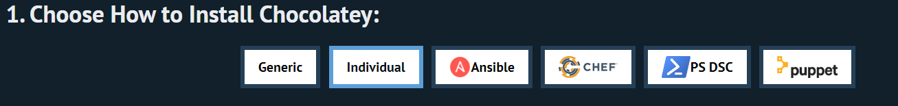

### DIA 03[24/07/24]

# Primeiros passos com K6

Usaremos o **[K6](https://k6.io/docs/get-started/installation/)** como ferramenta de teste essa sprint.

## Instalação

Entre no site do **[K6](https://k6.io/docs/)**,e vá para o guia de **[Instalação](https://k6.io/docs/get-started/installation/).**

Em seguida de acordo com seus SO, siga os comando que são instruidos a cada sistema.

No caso do Windows você ira, e optar pelo Chocolatey, como será feito nessa sprint, siga as instruções abaixo.

1. Entre no site da **[Chocolatey](https://chocolatey.org/install#individual)**

2. Clique na aba **INDIVIDUAL**

    <a href="INDIVIDUAL.png"> </a>

3. Copie o seguinte comando:
    ```
    Set-ExecutionPolicy Bypass -Scope Process -Force; [System.Net.ServicePointManager]::SecurityProtocol = [System.Net.ServicePointManager]::SecurityProtocol -bor 3072; iex ((New-Object System.Net.WebClient).DownloadString('https://community.chocolatey.org/install.ps1'))
    ```

4. Execute o Windows PowerShell como administrador

5. Cole o comando 

No mesmo prompt, vá para o site do **[K6](https://k6.io/docs/get-started/installation/)**.

E rode o seguinte comando: 
```
choco install k6
```

# Test Types

- Smoke Testing
```
O conceito desse teste, é a para verificar se o sistema consegue trabalhar com  o min de carga, sem ocorrer nenhum problema

Caso haja problema, não terá sentido seguir em frente com os prox testes.

Ele é o primeiro teste a ser feito, para verificação do sistema
```
- Load Testing 
```
Teste de performance em geral, não chegando até o limite.
```
- Stress Testing

Ver o limite do sistema , e sua estabilidade

- Spike Testing

Foca no pico , numero alto de acessos ou quantidade alta de dados

- Soak/Endurance Testing(Resistencia) 

Sistema sendo estressado , por uma longa quantidade de tempo, não necessariamente em seus limites.  

Ver se irá ocorrer algum problema , como ele vai se comportar.


