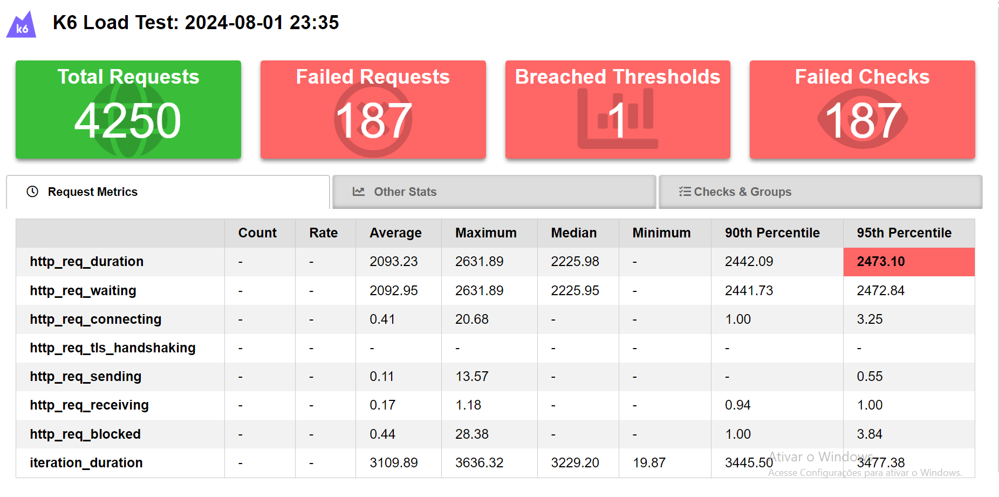

## FLuxo

vus: 10
duration: '2m'

# Teste Usuarios

### Teste Carga

vus: 500,
    duration: '15s',

### Teste Pico

duration: '5s', target: 50 
duration: '4s', target: 700

### Teste Escalabilidade

duration: '10s', target: 150 
{ duration: '10s', target: 250 },
{ duration: '10s', target: 350 },
{ duration: '10s', target: 450 },
{ duration: '10s', target: 550 },
{ duration: '10s', target: 650 },
{ duration: '10s', target: 0 }

### Teste Estresse

duration: '20s', target: 50
duration: '20s', target: 100
duration: '20s', target: 150
duration: '20s', target: 300
duration: '20s', target: 200
duration: '20s', target: 0

### Teste concorrencia

vus: 500,
    duration: '25s',

    ======================================================================
## Teste Login

### Teste de carga

vus: 500,
    duration: '25s'

### Teste Pico

duration: '5s', target: 50
duration: '4s', target: 700

### Teste Escalabilidade

duration: '10s', target: 150
duration: '10s', target: 250
duration: '10s', target: 350
duration: '10s', target: 450
duration: '10s', target: 550
duration: '10s', target: 650
duration: '10s', target: 0

### Teste Estresse

duration: '20s', target: 50
duration: '20s', target: 100
duration: '20s', target: 150
duration: '20s', target: 30
duration: '20s', target: 20
duration: '20s', target: 0

### Teste concorrencia

vus: 500,
    duration: '25s'

## Teste Produto
